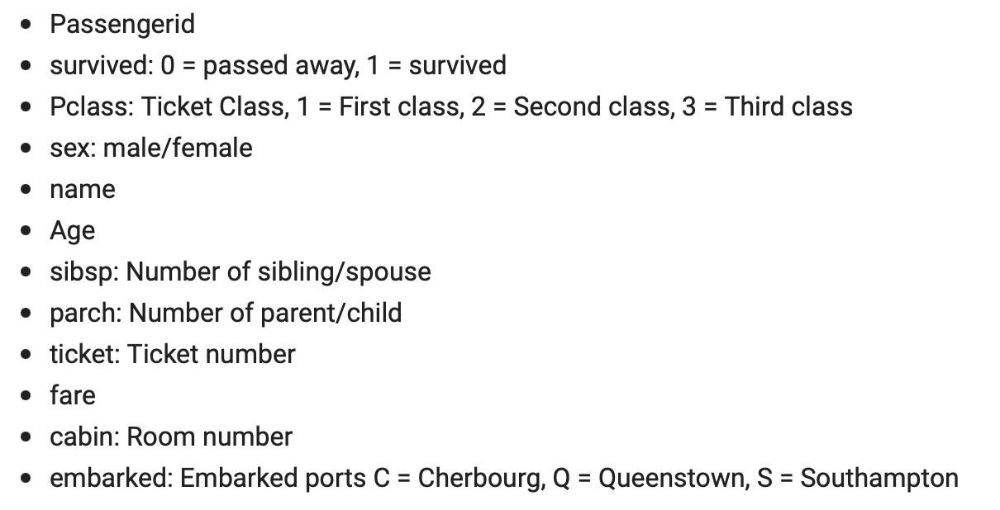
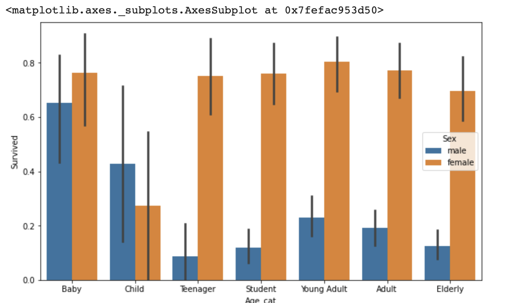
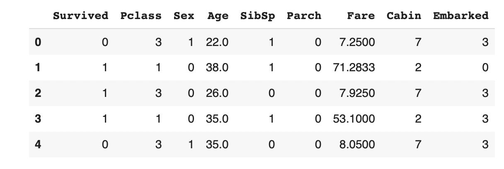
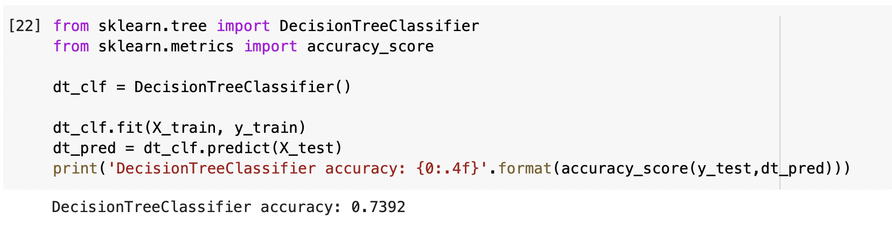
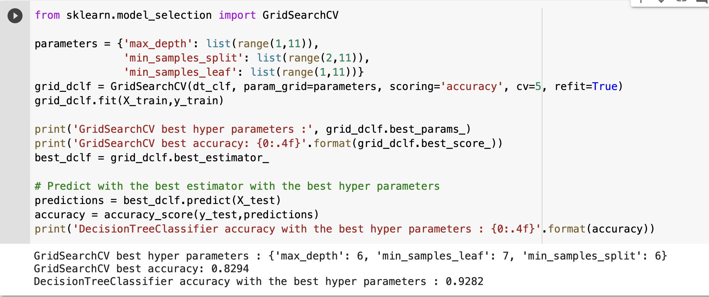

# Titanic Survivor Estimator

## 1. Dataset

[Titanic - Machine Learning from Disaster](https://www.kaggle.com/c/titanic)

## 2. EDA

## 3. Data Preprocessing

1) Drop unnecessary columns

2) Fill null values

3) Label Encoding

Final training dataset

## 4. ML Training

### 1. DecisionTreeClassifier Model

ML training using DecisionTreeClassifier

### 2. Cross-Validation using Stratified K-fold

### 3. Hyper parameter tuning using GridSeachCV

